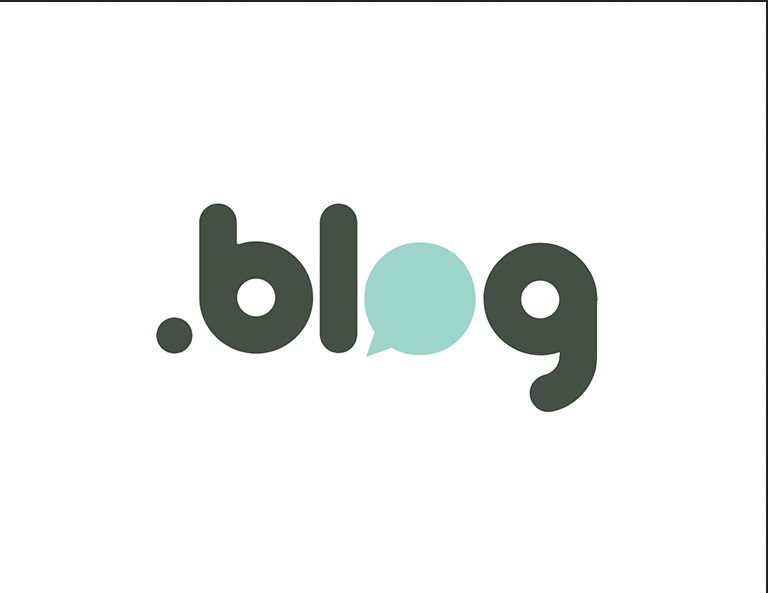

<!-- PROJECT LOGO -->
 

    

  <h3 align="center">This is a easy blog created with [Hexo](https://hexo.io/)</h3>

  

    I try to share my life experience with my OCD (Obsessive Compulsive Disorder).
     
     
    ·
    <a href="https://github.com/Benrhu/LLDR-Blog/issues">Report Bug</a>
    ·
    <a href="https://github.com/Benrhu/LLDR-Blog/issues">Request Feature</a>
  

<!-- TABLE OF CONTENTS -->

  
Table of Contents

  <ol>
    <li>
      <a href="#about-the-project">About The Project</a>
      <ul>
        <li><a href="#built-with">Built With</a></li>
      </ul>
    </li>
    <li>
      <a href="#getting-started">Getting Started</a>
      <ul>
        <li><a href="#prerequisites">Prerequisites</a></li>
        <li><a href="#installation">Installation</a></li>
      </ul>
    </li>
    <li><a href="#usage">Usage</a></li>
    <li><a href="#roadmap">Roadmap</a></li>
    <li><a href="#contributing">Contributing</a></li>
    <li><a href="#license">License</a></li>
    <li><a href="#contact">Contact</a></li>
    <li><a href="#acknowledgments">Acknowledgments</a></li>
  </ol>

<!-- ABOUT THE PROJECT -->
## About The Project

As you can imagine, I've OCD (Obsessive Compulsive Disorder) and I want to share my experience.

(<a href="#top">Back to top</a>)

### Built With

This section should list any major frameworks/libraries used to develop this project:

* [Hexo](https://hexo.io/)

(<a href="#top">Back to top</a>)

<!-- LICENSE -->
## License

Distributed under the MIT License.

(<a href="#top">Back to top</a>)

<!-- CONTACT -->
## Contact

Rubén díaz - [@Rubdh89](https://twitter.com/rubdh89) - rubendiaz300000@gmail.com

(<a href="#top">Back to top</a>)

